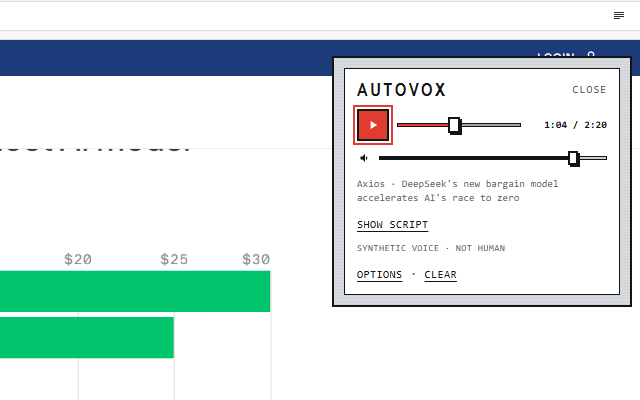

# Autovox

**Autovox** digests a web page into a spoken news report—with real comprehension, not just a summary or TTS.

[Install from the Chrome Web Store](https://chromewebstore.google.com/detail/autovox/aodlbiejdiibbpemagfngbdhaappejda)

## Features

- On-page overlay player (toolbar icon toggles it)
- Right-click **Vox this page** opens Autovox and starts the brief
- Play starts the brief when idle — one transport control
- Progressive scrubber (buffered + played), seek within downloaded audio
- In-memory PCM cache for replay without re-calling TTS
- OpenRouter OAuth (preferred) or OpenAI API key fallback
- Voice, output language, and report length in Options only

## Privacy

See [PRIVACY.md](./PRIVACY.md). API keys stay in `chrome.storage.local` on your profile. Page text is sent only to the AI provider you configure. Autovox has no backend.

Page access uses `activeTab` + `scripting` when you click the toolbar icon or **Vox this page** — not a persistent `<all_urls>` host permission. The `contextMenus` permission is only for that right-click entry.

## Developers

- [Development setup](docs/development.md)
- [Publishing to the Chrome Web Store](docs/publishing.md)
- [Contributing](CONTRIBUTING.md)
- [Design — Wire Meter](DESIGN.md)
- [Store listing assets](store/listing.md)

## License

[MIT](./LICENSE) © tsjnsn
